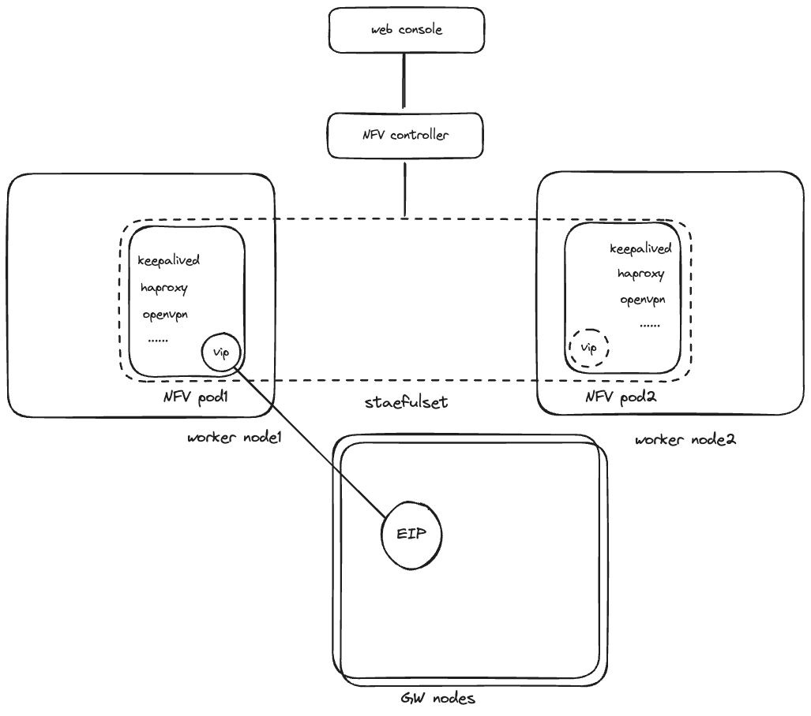

# Kube-Combo


Kube-Combo 是一款基于 Pod 来提供各种各样网元能力的编排系统，提供丰富的功能以及良好的可运维性。



- 基于 k8s operator 框架实现 NFV 网元控制器
- 基于 certmanager 维护 CA 证书
- 基于 keepalived vip 保证网元高可用
- 基于 SDN 高可用集中式网关 EIP 为网元提供公网
- 基于 statefulset 多副本 pod 避免单点故障
- 基于 POD exec 管理网元业务（配置更新，daemon 重载）

## 丰富的功能

如果你发现在 K8S 集群中无法直接使用一些高级的网络功能，比如 IPsec vpn GW，SSL vpn GW，Haproxy(l4, l7 lb) 等，那么 Kube-Combo 将是你的最佳选择。
借助 K8S CNI 提供的底层能力，可以通过多 POD 负载结合各种各样的成熟的应用，提供高可用且丰富的网元能力。

## 良好的可运维性

Kube-Combo 支持一键安装，帮助用户迅速搭建生产就绪的网络应用。同时内置的丰富的监控指标和 Grafana 面板，可帮助用户建立完善的监控体系。

## 1. Devlop

### 1.1 build

```bash

# 生成部署模版
make manifests

```

```bash

make docker-pull-base
make docker-build-all

```

## 2. deploy

```bash

make docker-pull-all
# if kubeovn kind env
make kind-load-image
```
install kubecombo crd and deploy operator

```bash
make install
make deploy
```

