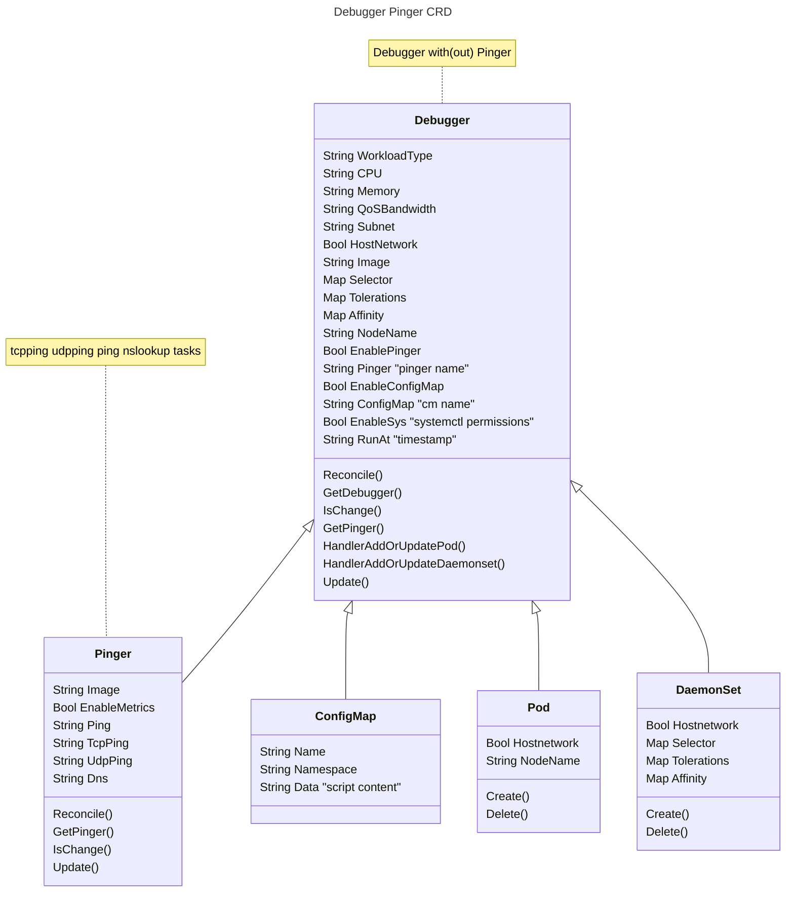
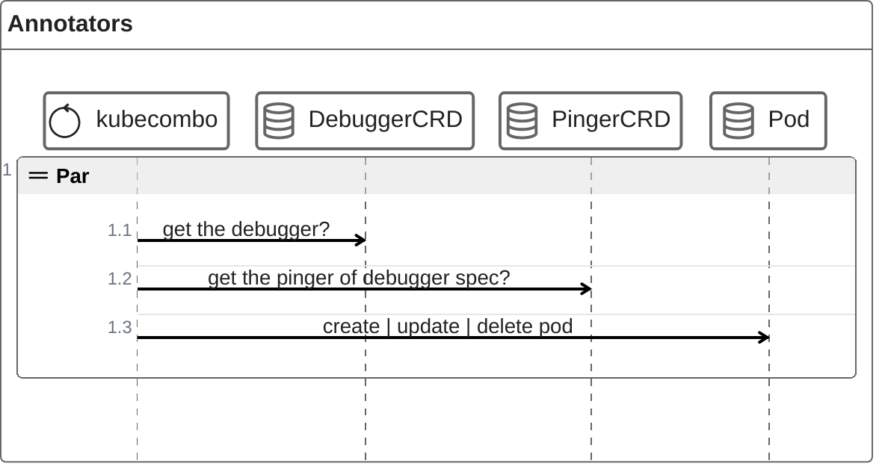
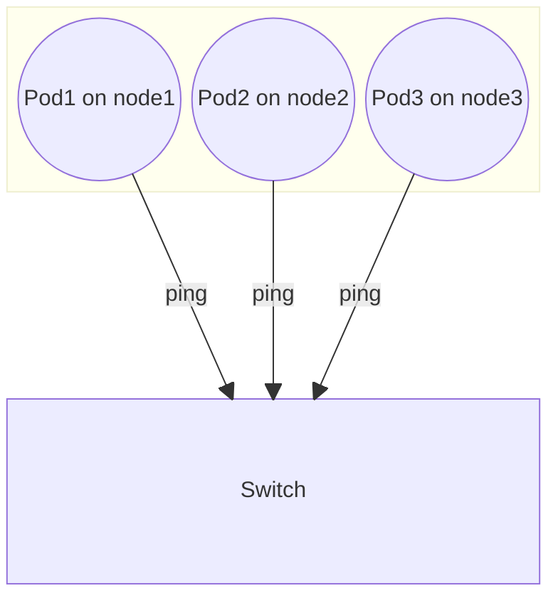

# Debugger Pinger

## 1. UML



Debugger CRD:

1. 控制 pod 的生命周期
2. 至少提供一个 pod 用于执行脚本：巡检，定位等

Pinger CRD：

1. 持久化维护 ping 测任务：`ping`  `udp`  `tcp`  `nslookup`
2. 可以选择是否启用 metrics

任务如果执行失败，会以 event 的形式记录到 pod

如果没有 Pinger，Debugger 只会启动一个容器

### 1.1 巡检任务执行方式

- 常规巡检：DS pod 常驻，基于 debugger spec runAt 手动或者定时触发所有任务执行。结果: 1. 一级概览通过 configmap 反馈， 2. 二级详情只能进入 pod 内部查看具体业务脚本的 log。
- （客户）自定义脚本巡检：Job pod 类型，用户可以通过 ConfigMap 注入脚本，脚本执行一次即完成。结果只能通过 logs 查看。
- （客户）自定义 pinger 巡检： 通过 pinger crd 维护 ping 测任务。异常结果只能通过 pod 状态和 logs 查看（log 足够可读性）。

### 1.2 一级概览 configmap 设计

config data 中设计为 map：

```bash

node1:
  disk:
    sdb1:
      err: "disk full" (错误码)
    sdb2:
  net:
    eth0:
    eth1:
    eth2:
      err: "link down" (错误码)
node2:
...

```

operator 会检测 runAt 任务是否执行完毕，如果执行完毕，则会逐个更新 configmap

### 1.3 脚本目录设计

- `/scripts`：脚本目录

一级业务目录

- `/scripts/disk`：disk 检查相关脚本
- `/scripts/disk/errlog`：disk 检查相关 log: 按照 runAt 命名
- `/scripts/net`：net 检查相关脚本
- `/scripts/net/errlog`：net 检查相关 log: 按照 runAt 命名
- `/scripts/mem`mem 检查相关脚本
- `/scripts/mem/errlog`mem 检查相关 log: 按照 runAt 命名
- `/scripts/svc` svc 检查相关脚本
- `/scripts/svc/errlog` svc 检查相关 log: 按照 runAt 命名

每个一级业务目录下设计一个 errlog，只存储出现执行错误的命令和返回信息，便于精确定位
正常执行的 log 不持久化存储，不需要考虑维护问题。
而且 pod 的 log 是可读的。

### 1.4 UI

- 1.基于 runAt 的 configmap 展示一级概览
- 2.可以查看 pod log
- 3.可以 exec pod 精确查看业务 errlog（每个业务只有一个 err log 文件）

## 2. Sequence



## 3. topo

ping gw



默认统一 daemonset 内的 pinger 启动后，不同 node 上的 pod 都会进行互相 ping 测，到交换机网关则需要在 pinger spec 中指定网关 ip，而且 pod 本身启动时 kube-ovn-cni 会自动检测 ping 网关。
