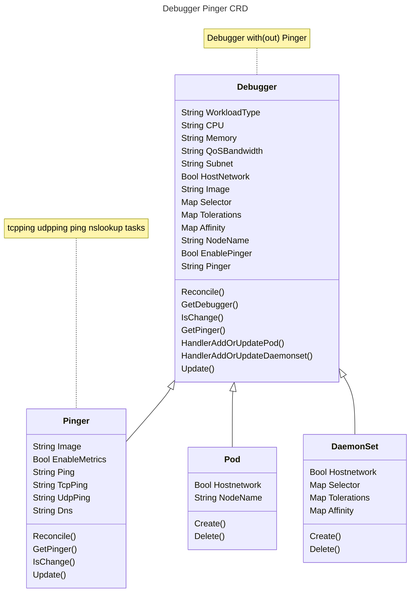
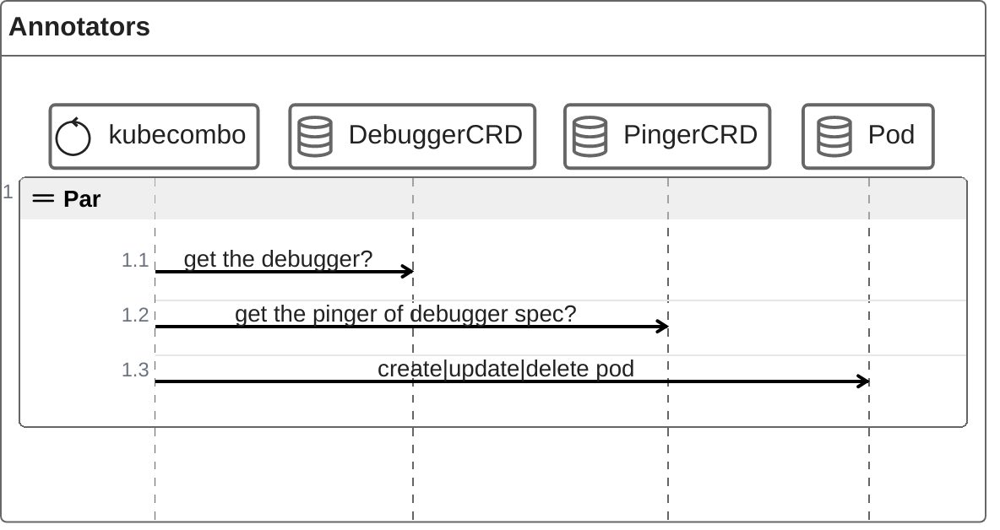
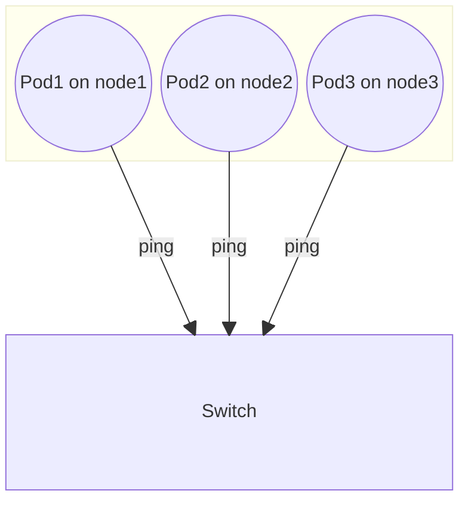

# Debugger Pinger

## 1. UML

Debugger CRD:

1. 控制 pod 的生命周期
2. 至少提供一个 pod 用于执行脚本：巡检，定位等

Pinger CRD：

1. 持久化维护 ping 测任务：ping udp tcp nslookup 
2. 可以选择是否启用 metrics

如果没有 Pinger，Debugger 只会启动一个容器

## 2. Sequence

## 3. Ping topo

ping gw

默认统一 daemonset 内的 pinger启动后，不同 node 上的 pod 都会进行互相 ping 测，到交换机网关则需要在 pinger spec 中执行网关 ip

